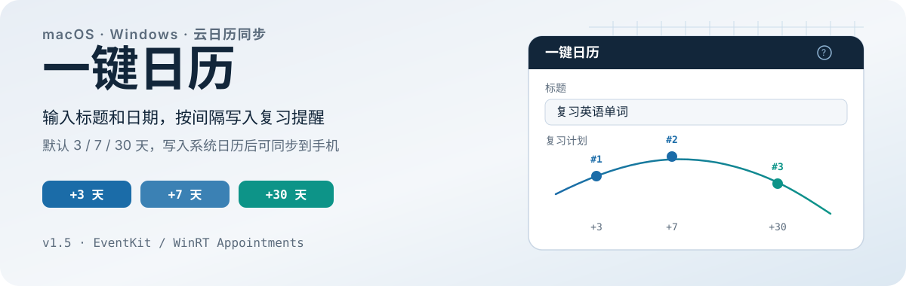
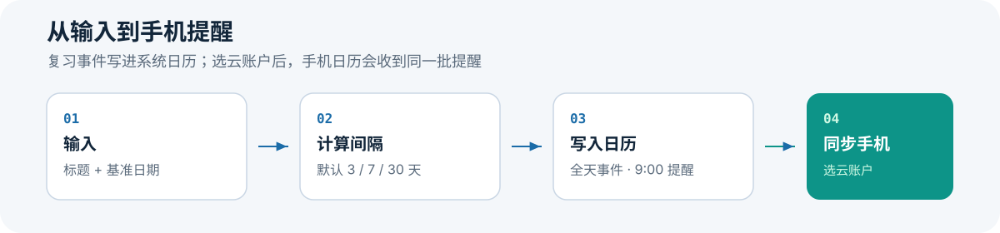

<p align="center">
  
</p>

# 一键日历

输入标题和日期，应用按间隔在系统日历创建全天复习事件。默认间隔是 3、7、30 天。你也可以改间隔，或切换到单次日程。选云日历账户后，同一批提醒会出现在手机日历里。

支持 **macOS 14+**（SwiftUI / EventKit）和 **Windows 10 1809+ / 11**（WinUI 3 / WinRT Appointments）。Windows 细节见 [`windows/README.md`](windows/README.md)。

<p align="center">
  
</p>

## 它做什么

- 按间隔生成多条复习日程，或只建一条单次日程
- 把事件写进你选的系统日历账户，并做同日同名重复检测
- 撤销最近一批创建，并保留最近 20 条历史供复用
- 在主界面查看昨天、今天、明天的日程，并搜索未来 90 天

间隔预设：

| 预设 | 间隔（天） |
| --- | --- |
| 日常复习（默认） | 3, 7, 30 |
| 经典艾宾浩斯 | 1, 2, 4, 7, 15 |
| 考试冲刺 | 1, 3, 7 |

也可自定义最多 10 个递增间隔（1-365 天）。

## 安装

### macOS：下载安装包

从 [最新 Release](https://github.com/a-RunShine/yijian-rili/releases/latest) 下载：

- `YijianRili-v*-macOS.dmg`，或
- `YijianRili-v*-macOS.app.zip`

把 `一键日历.app` 拖到「应用程序」。首次打开时，在系统对话框里允许日历完整访问。

### macOS：从源码构建

```bash
git clone https://github.com/a-RunShine/yijian-rili.git
cd yijian-rili
make install
```

`make install` 会做 release 构建、打包资源、ad-hoc 签名，并安装到 `/Applications/一键日历.app`。

本地调试：

```bash
swift build
swift run
swift test
```

### Windows

见 [`windows/README.md`](windows/README.md)。领域层可在任意平台跑 `dotnet test`；完整 UI 需要 Windows + Windows App SDK。

## 第一次创建复习计划

1. 打开应用，输入标题，例如「复习英语单词」。
2. 确认基准日期（默认今天）。
3. 在「写入日历」里选云账户；选「本地」只会留在这台电脑上。
4. 点「一键创建」，或按 **Cmd+Enter**（Windows 为 **Ctrl+Enter**）。

应用会创建全天事件，并设 9:00 提醒。撤销只作用于最近一批。更早的事件在系统日历里删除。

## 同步到手机

事件写到哪个云账户，手机就能在哪个账户里看到。本地日历不同步。

### 推荐（macOS）：网易 163 CalDAV

1. 在 [mail.163.com](https://mail.163.com) 开启 CalDAV，并生成授权码。
2. 在 macOS「日历」里添加 CalDAV 账户：服务器 `caldav.163.com`，端口 `443`，密码用授权码。
3. 在手机日历里用同一套账户添加 CalDAV。
4. 在一键日历的「写入日历」里选 163 下的某个日历。

未配置云账户时，启动约 3 秒后会弹出 3 步引导。标题栏「?」可随时再看。

<details>
<summary>其他同步源</summary>

| 服务 | 服务器 | 备注 |
| --- | --- | --- |
| 移动 139 | `cal.caiyun.mail.10086.cn:443` | 用户名是 `手机号@139.com`；授权码约 90 天有效 |
| 阿里云企业邮箱 | `caldav.mxhichina.com` | 收费版更稳 |
| iCloud | `https://caldav.icloud.com` | 中国大陆区 Apple ID 可能需要代理 |
| Google | 系统自动 | Android 需 Google Play Services |
| Outlook.com | `s.outlook.com:443`（EAS） | ColorOS 上建议用 Outlook App |
| QQ 邮箱 | — | 不支持 CalDAV |

Windows 优先用 Outlook 或 Google，步骤见 [`windows/README.md`](windows/README.md)。

</details>

## 系统要求

| 平台 | 要求 |
| --- | --- |
| macOS | 14.0+；日历 Full Access |
| Windows | 10 1809+ 或 11；.NET 8 + Windows App SDK；日历读写权限 |

当前没有 iOS / iPadOS 客户端。手机端靠云日历同步查看提醒。

## 常见问题

**为什么需要日历完整访问？**  
应用要读日历列表、创建事件、并检测同日同名重复。

**选「本地」会怎样？**  
事件只留在本机。界面会给黄色警告，但仍允许创建。

**选中的日历账户删了怎么办？**  
应用回退到系统默认日历，并提示你重新选择。

**支持哪些主题？**  
浅色、深色、信纸、Claude、跟随系统。

## 许可

[MIT](LICENSE)
